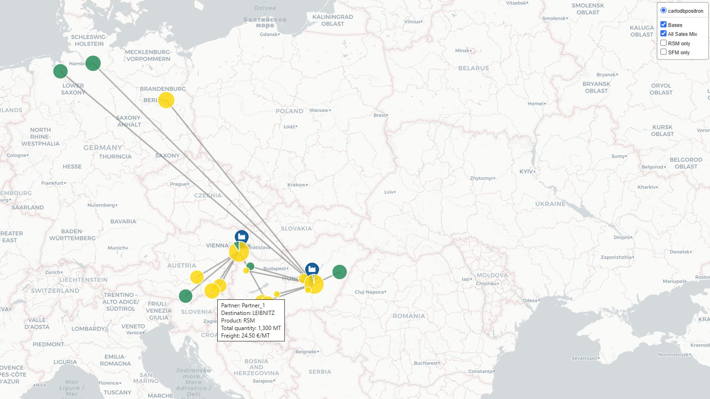
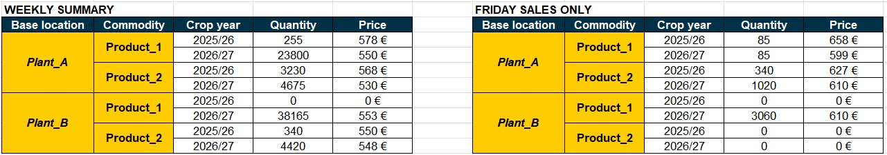

# SAP Sales Report and Logistics Map

Every morning the sales report had to be pulled from SAP, converted to EUR with the day's exchange rates and formatted for management. This took 45 to 60 minutes. This project does it in a single run, and at the end it can draw an interactive map showing where the goods are going.

Part of my [Automation Portfolio](https://github.com/NandesHungarian/Automation-Portfolio). All company-specific data (transaction codes, user IDs, folders, partner names) has been anonymized. The screenshots below were made with test data.





---

## How it works

**1. Getting the data out of SAP** (`sap_sales_automation.py`)

The script starts SAP Logon if it is not running, logs in through the SAP GUI Scripting API and runs the sales report transaction. On Mondays it pulls the whole previous week, on other days only the previous day. It exports the result to Excel and picks up the new workbook automatically.

**2. Preparing the report**

- Removes purchase rows and keeps only the sales team's own contracts
- Converts HUF and USD prices and freight costs to EUR. The exchange rates come from the daily rate files, matched to each contract's date
- If a delivered contract (not FCA) has no freight cost, a small window asks for it. The answer is remembered for the other lines of the same contract
- Finds columns by their header name, so a changed SAP layout does not break it
- Marks suspicious rows in red, for example internal partners or a HUF price that is clearly too low
- Adds a summary table at the bottom: quantity and weighted average net EUR price by base, product and crop year. The weekly report gets a second table with Friday's sales only
- Writes every skipped row and failed run with the reason to `sap_automation.log`, so nothing fails silently

**3. The map** (`map_generator.py`)

After the report is saved, the script offers to build the map. It reads the finished report and creates a single HTML file that opens in any browser.

- Lines from the loading bases to the delivery cities, sized by quantity and colored by product
- FCA volumes shown at the base itself
- Hovering over a point shows the partner, destination, product, quantity and freight
- Products can be switched on and off
- City coordinates come from OpenStreetMap and are saved locally, so each city is looked up only once. If a city name is unclear, a small window asks which one is meant

---

## Setup

Needs Windows, Microsoft Excel and SAP GUI with scripting enabled (SAP Logon, Options, Scripting).

```bash
pip install -r requirements.txt
```

On the first run the script asks for the SAP username and password once and stores them in **Windows Credential Manager**. The password is never written to a file. To enter a new password, run:

```bash
python sap_sales_automation.py --reset-login
```

Set the folders and SAP settings in the configuration block at the top of `sap_sales_automation.py`.

---

## Built with

Python · `pywin32` (SAP and Excel automation) · `pandas` · `openpyxl` · `folium` (map) · `geopy` (city lookup) · `keyring` (password storage) · `tkinter` (input windows)
